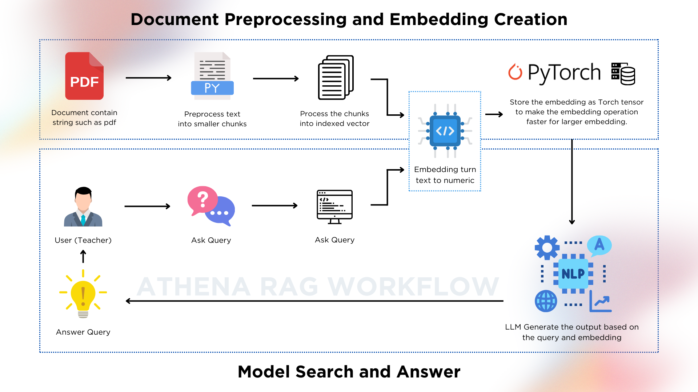

### Athena Learning Assistant - Sentence Embedding Model

---

#### Model Overview

This repository contains a fine-tuned sentence embedding model designed for natural language understanding tasks. Specifically, it utilizes `indobenchmark/indobert-base-p2` from Hugging Face's Transformers library and is fine-tuned on the IndonLI dataset.

---

#### What is Sentence Embedding?

Sentence embedding refers to the process of converting a sentence or a piece of text into a numerical vector representation. This representation captures semantic and syntactic information about the sentence, enabling algorithms to understand the meaning and context of the text. 

#### How It Works in Athena Learning Assistant

This repository employs the Sentence Transformers library to create and fine-tune a sentence embedding model using `indobenchmark/indobert-base-p2`. Here's how the model works in the Athena Learning Assistant:

1. **Model Architecture**: The model architecture consists of a Transformer-based neural network (`indobert-base-p2`) followed by a pooling layer. This setup allows the model to encode input sentences into fixed-length vectors while preserving their contextual meaning.

2. **Fine-tuning**: The model is fine-tuned on the IndonLI dataset, which includes tasks like natural language inference. Fine-tuning adapts the pre-trained model to better understand and generate embeddings specific to Indonesian language tasks.

3. **Evaluation**: After fine-tuning, the model's performance is evaluated using evaluation metrics such as embedding similarity scores on validation and test datasets. This ensures that the embeddings effectively capture semantic similarities between sentences.

4. **Inference**: Once trained, the model can encode new sentences into embeddings. These embeddings can then be used for tasks such as semantic search, information retrieval, or similarity scoring.

---

#### Getting Started

To get started with this model, follow these steps:

1. **Installation**
   ```bash
   !pip install -q datasets sentence-transformers
   ```

2. **Loading the Dataset**
   ```python
   from datasets import load_dataset

   datasets = load_dataset('indonli')
   ```

3. **Fine-tuning the Model**
   ```python
   from sentence_transformers import SentenceTransformer, models
   from sentence_transformers import InputExample, losses, evaluation
   from torch.utils.data import DataLoader
   import math

   # Define your model
   word_embedding_model = models.Transformer('indobenchmark/indobert-base-p2', max_seq_length=75)
   pooling_model = models.Pooling(word_embedding_model.get_word_embedding_dimension())
   model = SentenceTransformer(modules=[word_embedding_model, pooling_model])

   # Prepare data for training
   train_examples = [InputExample(texts=[item['premise'], item['hypothesis']], label=item['label']) for item in datasets['train']]
   dev_examples = [InputExample(texts=[item['premise'], item['hypothesis']], label=item['label']) for item in datasets['validation']]

   # Define train data loader and loss
   train_dataloader = DataLoader(train_examples, shuffle=True, batch_size=16)
   train_loss = losses.MultipleNegativesRankingLoss(model)

   # Define evaluation on development set
   dev_evaluator = evaluation.EmbeddingSimilarityEvaluator.from_input_examples(dev_examples, batch_size=16, name='sts-dev')

   # Fine-tune the model
   num_epochs = 1
   warmup_steps = math.ceil(len(train_dataloader) * num_epochs * 0.1)
   evaluation_steps = int(len(train_dataloader) * 0.1)
   model_save_path = 'indobert-finetuned-indonli'
   model.fit(train_objectives=[(train_dataloader, train_loss)], epochs=num_epochs, warmup_steps=warmup_steps, evaluator=dev_evaluator, evaluation_steps=evaluation_steps, output_path=model_save_path)
   ```

4. **Using the Model**

   After fine-tuning, you can use the model for inference and similarity scoring:
   ```python
   from sentence_transformers import SentenceTransformer, util

   # Load the fine-tuned model
   trained_model = SentenceTransformer(model_save_path)

   # Example usage for similarity scoring
   sentences1 = ['Topi saya bundar', 'Kalau tidak bundar.']
   sentences2 = ['Bundar topi saya', 'bukan topi saya.']
   embeddings1 = trained_model.encode(sentences1, convert_to_tensor=True)
   embeddings2 = trained_model.encode(sentences2, convert_to_tensor=True)
   cosine_scores = util.cos_sim(embeddings1, embeddings2)

   for i in range(len(sentences1)):
       print("{} \t\t {} \t\t Score: {:.4f}".format(sentences1[i], sentences2[i], cosine_scores[i][i]))
   ```

5. **Evaluation**

   Evaluate the model on a test set using the `evaluation.EmbeddingSimilarityEvaluator`:
   ```python
   test_samples = [InputExample(texts=[item['premise'], item['hypothesis']], label=item['label']) for item in datasets['test_expert']]
   test_evaluator = evaluation.EmbeddingSimilarityEvaluator.from_input_examples(test_samples, batch_size=16, name='sts-test')
   results = test_evaluator(trained_model, output_path=model_save_path)
   ```

---

#### Additional Information

For more details on the original model or dataset used for fine-tuning, refer to:
- [IndoBERT](https://huggingface.co/indobenchmark/indobert-base-p2)
- [IndoNLI Dataset](https://huggingface.co/datasets/indonli)

---

#### License

This project is not licensed yet

---

Feel free to modify and extend this repository as needed for your applications or research in natural language processing. For any questions or issues, please contact me.

---

*Note: Adjust `model_save_path`, batch sizes, and other parameters based on your specific requirements and computing resources.*
